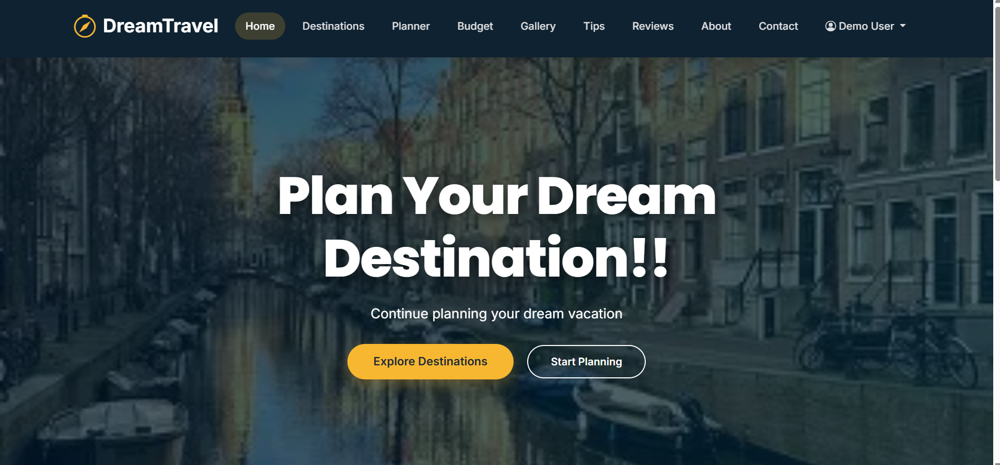
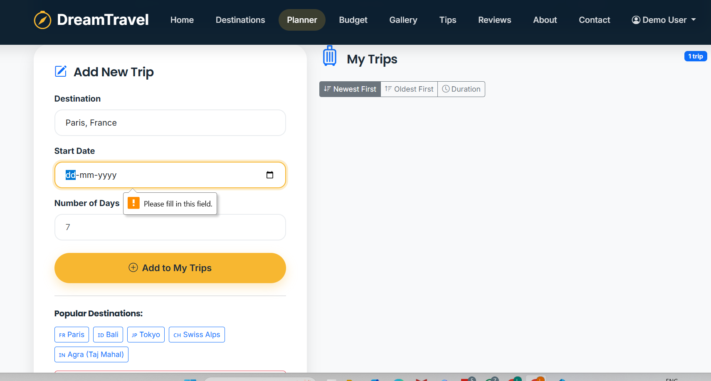
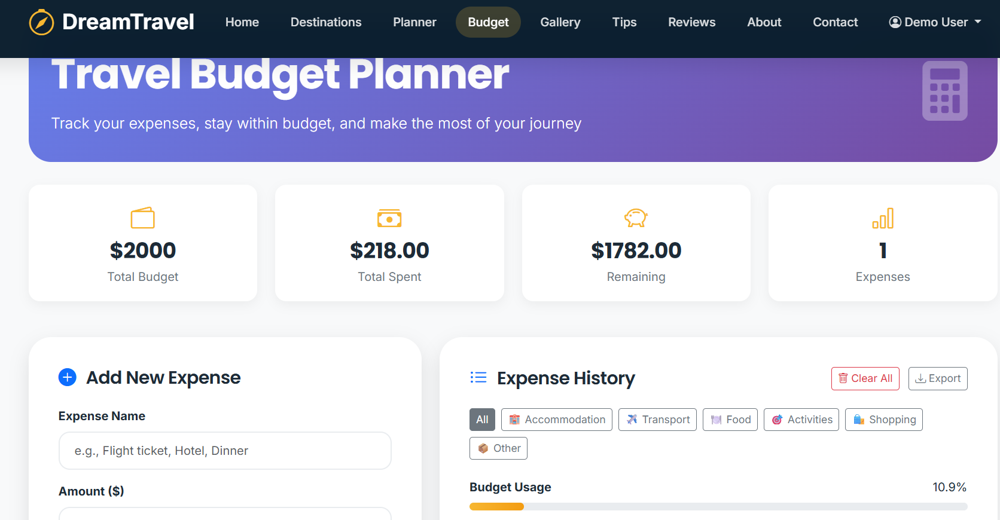
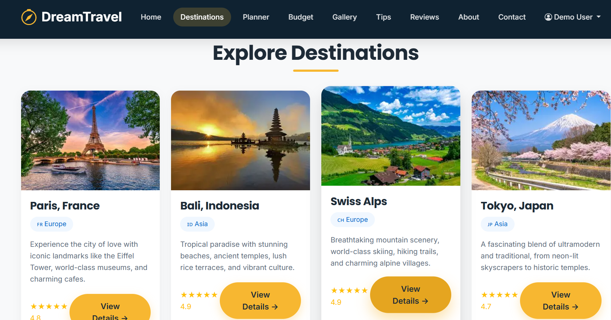
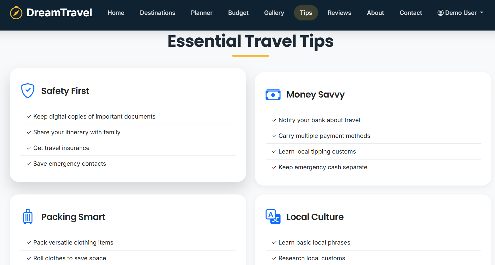

# ✈️ Dream Travel Planner

<div align="center">
  
  
  
  
  
  
  
  
  <h3>Plan Your Dream Vacation with Ease</h3>
  
  [Live Demo](https://your-demo-link.com) • 
  [Report Bug](https://github.com/yourusername/dream-travel-planner/issues) • 
  [Request Feature](https://github.com/yourusername/dream-travel-planner/issues)
  
</div>

---

## 📋 Table of Contents
- [About The Project](#-about-the-project)
- [✨ Features](#-features)
- [📸 Screenshots](#-screenshots)
- [🛠️ Built With](#️-built-with)
- [📁 Project Structure](#-project-structure)
- [🚀 Getting Started](#-getting-started)
- [💻 Usage](#-usage)
- [📱 Responsive Design](#-responsive-design)
- [💾 Data Persistence](#-data-persistence)
- [🤝 Contributing](#-contributing)
- [📄 License](#-license)
- [📞 Contact](#-contact)
- [🙏 Acknowledgments](#-acknowledgments)

---

## 🎯 About The Project

**Dream Travel Planner** is a beautiful, responsive frontend web application that helps travelers explore destinations, plan their itineraries, and manage travel budgets - all without any backend! Whether you're dreaming of the Eiffel Tower in Paris, the serene beaches of Bali, or the majestic Taj Mahal in Agra, this app helps you organize your perfect vacation.

### Why Choose Dream Travel Planner?
- 🎨 **Clean & Modern UI** - Intuitive interface with stunning visuals
- 📱 **Fully Responsive** - Works seamlessly on desktop, tablet, and mobile
- 💾 **No Backend Required** - All data stored in your browser
- 🔒 **Privacy First** - Your travel plans stay on your device
- ⚡ **Fast & Lightweight** - Quick loading and smooth interactions

---

## ✨ Features

### 🗺️ **Destination Explorer**
| Feature | Description |
|---------|-------------|
| **8+ Destinations** | Paris, Bali, Swiss Alps, Tokyo, Agra, Amsterdam, Seoul, Great Wall of China |
| **Detailed Information** | Description, attractions, best time to visit, currency, language, timezone |
| **Rating System** | Star ratings and review counts |
| **Budget Estimates** | Daily budget breakdown (Budget/Mid-range/Luxury) |
| **Dynamic Content** | Each destination has unique, detailed information |

### 📅 **Trip Planner**
| Feature | Description |
|---------|-------------|
| **Add Trips** | Save destinations with start dates and duration |
| **LocalStorage** | Trips persist even after browser refresh |
| **Trip Statistics** | Total trips, total days, unique countries |
| **Sort Options** | Newest first, oldest first, by duration |
| **Quick Destinations** | One-click popular destination buttons |
| **Delete Options** | Remove individual trips or clear all |

### 💰 **Budget Tracker**
| Feature | Description |
|---------|-------------|
| **Expense Categories** | Accommodation, Transport, Food, Activities, Shopping, Other |
| **Category Badges** | Color-coded categories for easy identification |
| **Progress Bars** | Visual representation of budget usage |
| **Statistics Dashboard** | Total budget, spent, remaining, expense count |
| **Budget Alerts** | Warning when exceeding budget |
| **Filter Expenses** | View expenses by category |
| **Export Data** | Download budget data as JSON |
| **Quick Add Templates** | Pre-filled common expenses |

### 🖼️ **Gallery**
- Stunning destination images with hover effects
- Overlay descriptions for each photo
- Responsive grid layout

### 💬 **Reviews System**
- Read traveler reviews
- Submit new reviews with star ratings
- Reviews saved in localStorage
- Timestamps for each review

### ℹ️ **Additional Pages**
- **Travel Tips** - Essential advice for travelers
- **About Us** - Company information and stats
- **Contact Form** - Get in touch with validation

---

## 📸 Screenshots

<div align="center">
  
## 📸 Screenshots

### 🏠 Home Page


### 📄 Front Page


### 📅 Planner


### 💰 Budget


### 🌍 Destination


### 💡 Tips


</div>

---

## 🛠️ Built With

### Frontend Technologies
| Technology | Purpose |
|------------|---------|
| **HTML5** | Semantic page structure |
| **CSS3** | Custom styling, animations, transitions |
| **Bootstrap 5** | Responsive grid system, UI components |
| **JavaScript (ES6)** | Interactive features, DOM manipulation |
| **LocalStorage API** | Client-side data persistence |
| **Bootstrap Icons** | Beautiful icon set |

### Key Bootstrap Components Used
- ✅ Navbar (responsive with mobile toggle)
- ✅ Grid System (12-column responsive layout)
- ✅ Cards (destinations, reviews, tips)
- ✅ Forms (trip planner, contact, reviews)
- ✅ Buttons (primary, outline, small, large)
- ✅ Badges (ratings, categories, tags)
- ✅ Progress Bars (budget visualization)
- ✅ Input Groups (currency prefix)
- ✅ Utility Classes (spacing, display, colors)

### JavaScript Features
- ✅ ES6 Classes (TripPlanner, BudgetPlanner)
- ✅ Array Methods (map, filter, reduce)
- ✅ LocalStorage API (save/load data)
- ✅ Event Listeners (interactive elements)
- ✅ Date Formatting (trip dates, time ago)
- ✅ Form Validation (contact, reviews)

---

## 📁 Project Structure
DREAM-TRAVEL-PLANNER/
│
├── 📄 index.html # Home page with hero section & featured destinations
├── 📄 destinations.html # All destinations grid view
├── 📄 destination-details.html # Individual destination details (dynamic)
├── 📄 planner.html # Trip planner with localStorage
├── 📄 budget.html # Advanced budget tracker
├── 📄 gallery.html # Image gallery with hover effects
├── 📄 tips.html # Travel tips & checklist
├── 📄 reviews.html # User reviews system
├── 📄 about.html # About us page
├── 📄 contact.html # Contact form with validation
├── 📄 README.md # Project documentation
│
├── 📁 css/
│ └── 📄 style.css # Custom styles & Bootstrap overrides
│
├── 📁 js/
│ └── 📄 script.js # JavaScript functionality
│
└── 📁 images/ # Destination images
├── 📄 paris.jpg
├── 📄 Bali.jpg
├── 📄 India.jpg
├── 📄 Switzerland.jpg
├── 📄 Japan.jpg
├── 📄 Amsterdam.jpg
├── 📄 SouthKorea.jpg
├── 📄 China.jpg
├── 📄 Netherland.jpg


---

## 🚀 Getting Started

### Prerequisites
- A modern web browser (Chrome, Firefox, Safari, Edge)
- No server required! Works locally

### Installation

1. **Clone the repository**
   ```bash
   git clone https://github.com/DishaAgarwalla/dream-travel-planner.git

2. Navigate to project folder
   cd dream-travel-planner

3. Open in browser
   # Option 1: Double-click index.html

# Option 2: Use Python server
python -m http.server 8000
# Then visit http://localhost:8000

# Option 3: Use VS Code Live Server extension

4. Start planning your dream vacation! 🎉

## 💻 Usage

### Planning a Trip
1. Navigate to **Destinations** page
2. Click on any destination card
3. View detailed information
4. Click "Plan a Trip" button
5. Fill in dates and duration
6. Trip saves automatically!

### Tracking Budget
1. Go to **Budget** page
2. Set your total budget
3. Add expenses with categories
4. Watch progress bars update
5. Filter by category
6. Export data when done

### Writing Reviews
1. Visit **Reviews** page
2. Fill in your name and rating
3. Write your experience
4. Submit - it saves automatically!

## 📱 Responsive Design

| Device | Breakpoint | Layout Behavior |
|--------|------------|-----------------|
| Mobile | < 576px | Stacked layout, hamburger menu |
| Tablet | ≥ 768px | 2-column grid, visible nav |
| Desktop | ≥ 992px | 3-4 column grid, full features |
| Wide | ≥ 1200px | Maximum layout width |

## 💾 Data Persistence

| Feature | Storage Key | Data Stored |
|---------|-------------|-------------|
| Trips | `dreamTravelTrips` | All user trips with dates |
| Budget | `travelExpenses` | Expense history |
| Budget Total | `travelBudget` | Total budget amount |
| Reviews | `dreamTravelReviews` | User reviews |

*No backend required! All data stays in your browser.*

## 🤝 Contributing

1. Fork the Project
2. Create Feature Branch (`git checkout -b feature/AmazingFeature`)
3. Commit Changes (`git commit -m 'Add feature'`)
4. Push to Branch (`git push origin feature/AmazingFeature`)
5. Open a Pull Request

### Ideas
- 🌍 Add more destinations
- 💱 Currency converter
- 🌤️ Weather API
- 🗺️ Interactive maps
- 🌙 Dark mode

## 📄 License

MIT License © 2026

## 📞 Contact


Project: https://github.com/DishaAgarwalla/Dream-Travel-Planner

## 🙏 Acknowledgments

- Images: Unsplash, Pexels
- Icons: Bootstrap Icons
- Framework: Bootstrap 5
- Fonts: Google Fonts

---

⭐ **Star this repo if you find it useful!**

© 2026 Dream Travel Planner
